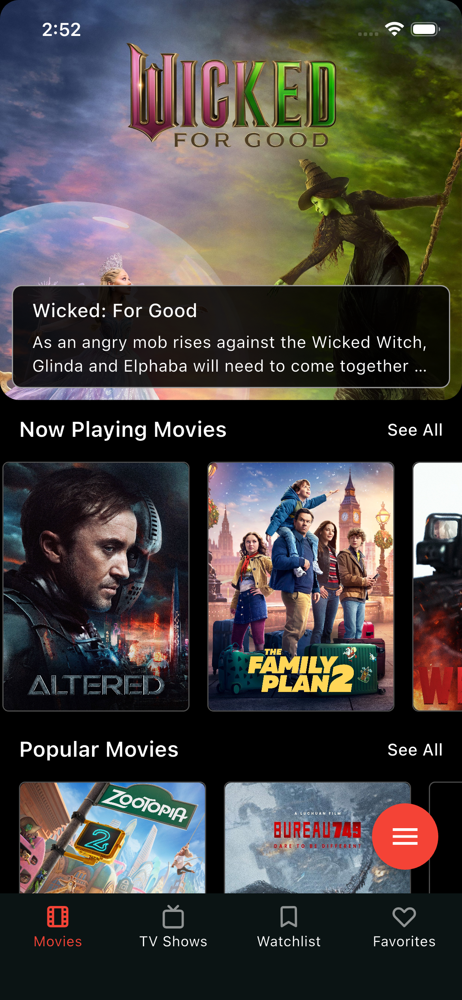
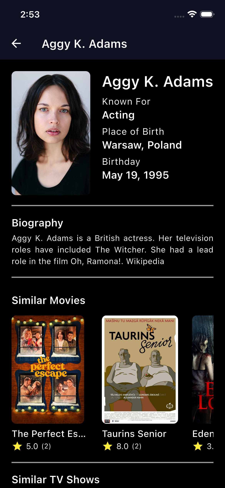
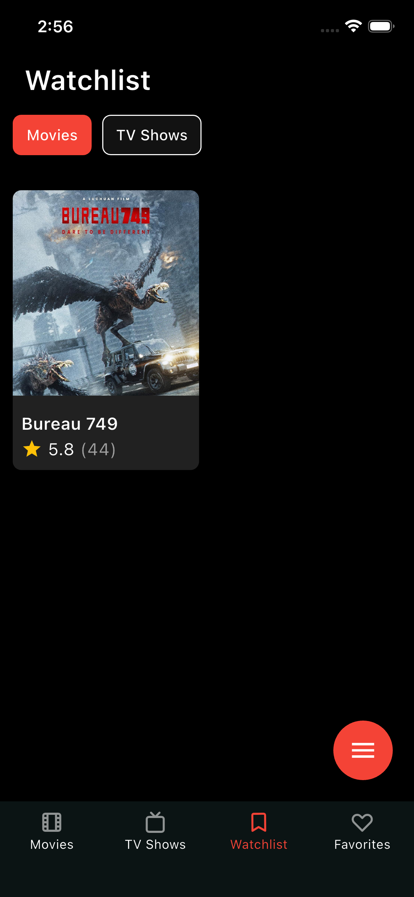
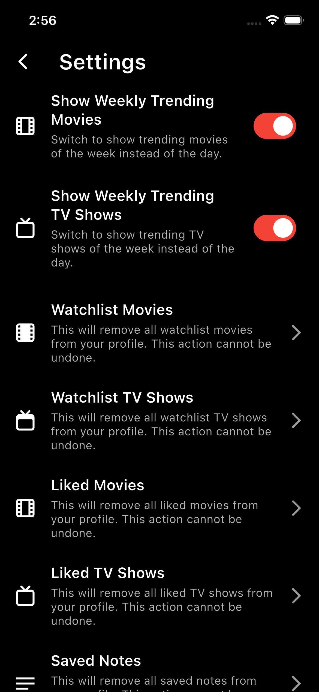

# MoviesBox 🎬

A comprehensive Flutter application for movie and TV show enthusiasts. Discover trending movies, explore detailed information, track your favorites, and enjoy a seamless entertainment experience with integrated Firebase services and Google Mobile Ads.

[](https://flutter.dev)
[](https://firebase.google.com)
[](https://cloud.google.com)

<table>
    <tr>
    <td align="center"><b>Movie Screen</b></td>
    <td align="center"><b>Movie Details Screen</b></td>
  </tr>
  <tr>
    <td></td>
    <td></td>
  </tr>
    <tr>
    <td align="center"><b>Cast Details Screen</b></td>
    <td align="center"><b>Watchlist Screen</b></td>
  </tr>
  <tr>
    <td></td>
    <td></td>
  </tr>
  <tr>
    <td align="center"><b>Setting Screen</b></td>
    <td></td>
  </tr>
  <tr>
    <td></td>
    <td></td>
  </tr>
</table>


## Features ✨

- **Movie Discovery**: Browse trending, popular, top-rated, and upcoming movies
- **TV Shows**: Explore airing today, on-air, popular, and top-rated TV shows
- **Detailed Information**: Cast & crew details, recommendations, and similar content
- **Personalized Experience**: Notes and quiz features
- **Firebase Integration**: Analytics, Crashlytics, and Remote Config
- **Monetization**: Google Mobile Ads integration
- **Offline Support**: Local database with SQLite
- **Modern UI**: Smooth animations and responsive design
- **Onboarding**: Welcome screens for new users

## Tech Stack 🛠️

- **Flutter** - Cross-platform mobile development
- **Bloc Pattern** - State management with flutter_bloc
- **Clean Architecture** - Domain-driven design with dependency injection
- **Firebase** - Backend services (Analytics, Crashlytics, Remote Config, Firestore)
- **SQLite** - Local database storage
- **Get It** & **Injectable** - Dependency injection
- **Go Router** - Navigation and routing
- **Dio** - HTTP client for API calls
- **Google Mobile Ads** - Monetization

## Prerequisites 📋

Before you begin, ensure you have the following installed:

- Flutter SDK (3.8.1 or higher)
- Dart SDK
- Android Studio / Xcode for mobile development
- Firebase CLI (for Firebase configuration)
- A Firebase project set up

## Installation & Setup 🚀

### 1. Clone the Repository

```bash
git clone https://github.com/MrHarsh007/moviebox.git
cd moviebox
```

### 2. Install Dependencies

```bash
flutter pub get
```

### 3. Environment Configuration

Create a `.env` file in the root directory of the project:

```bash
touch .env
```

Add the following environment variables to your `.env` file:

```env
# API Configuration
TMDB_API_KEY=your_tmdb_api_key_here
BASE_URL=https://api.themoviedb.org/3

# App Configuration
APP_NAME=MoviesBox
DEBUG_MODE=true

# Firebase Configuration (if needed)
FIREBASE_PROJECT_ID=your_firebase_project_id
```

**Note**: Replace `your_tmdb_api_key_here` with your actual TMDB API key from [The Movie Database API](https://www.themoviedb.org/settings/api).

### 4. Firebase Configuration

#### 4.1 Create a Firebase Project

1. Go to [Firebase Console](https://console.firebase.google.com/)
2. Create a new project or use an existing one
3. Enable the following services:
   - **Analytics**
   - **Crashlytics**
   - **Remote Config**
   - **Firestore Database**

#### 4.2 Add Firebase to Your App

**For Android:**
1. Add your Android app in Firebase Console
2. Download `google-services.json`
3. Place it in `android/app/` directory

**For iOS:**
1. Add your iOS app in Firebase Console
2. Download `GoogleService-Info.plist`
3. Place it in `ios/Runner/` directory

#### 4.3 Firebase Remote Config Setup

The app uses Firebase Remote Config for dynamic configuration. Set up the following parameters in your Firebase Console:

1. Go to Firebase Console → Remote Config
2. Add these parameters:

| Parameter Key | Default Value | Description |
|---------------|---------------|-------------|
| `show_ad` | `false` | Controls ad visibility |
| `click_threshold` | `5` | Number of clicks before showing ads |
| `banner_ad_unit_id` | `YOUR_BANNER_AD_ID` | Banner ad unit ID |
| `interstitial_ad_unit_id` | `YOUR_INTERSTITIAL_AD_ID` | Interstitial ad unit ID |
| `app_open_ad_unit_id` | `YOUR_APP_OPEN_AD_ID` | App open ad unit ID |

The `remote_config.dart` file (`lib/src/utilities/remote_config.dart`) handles the configuration:

```dart
// Key features of remote_config.dart:
// - Initializes Firebase Remote Config
// - Sets default values for ad configuration
// - Provides methods to fetch string, boolean, and integer values
// - Handles dynamic app behavior based on remote configuration
```

#### 4.4 Update Remote Config

To modify remote configuration:

1. Update values in Firebase Console → Remote Config
2. Publish changes
3. The app will fetch new values on next startup or manual refresh

### 5. Google Mobile Ads Setup

1. Create an AdMob account at [AdMob](https://admob.google.com/)
2. Create ad units for your app
3. Update the ad unit IDs in Firebase Remote Config or directly in the code
4. Test with test ad unit IDs during development

### 6. Code Generation

Run the build runner to generate necessary files:

```bash
flutter packages pub run build_runner build --delete-conflicting-outputs
```

### 7. Run the Application

```bash
flutter run
```

## Project Structure 📁

```
lib/
├── main.dart                 # App entry point
├── firebase_options.dart     # Firebase configuration
├── injection/               # Dependency injection setup
├── src/
│   ├── core/               # Core functionality
│   │   ├── api/           # API constants and configurations
│   │   └── helpers/       # Utility helpers
│   ├── data/              # Data layer (repositories, models)
│   ├── domain/            # Domain layer (entities, use cases)
│   ├── presentation/      # UI layer (pages, widgets, blocs)
│   │   ├── ads/          # Advertisement related components
│   │   ├── bloc/         # State management (BLoC)
│   │   └── pages/        # App screens
│   └── utilities/         # Utility classes
│       └── remote_config.dart  # Firebase Remote Config service
```

## Key Files Configuration 🔧

### remote_config.dart

This file manages Firebase Remote Config and provides:

- **Dynamic Ad Control**: Enable/disable ads remotely
- **Threshold Management**: Control when ads appear
- **Ad Unit Configuration**: Manage ad unit IDs remotely
- **A/B Testing Support**: Test different configurations

Key methods:
- `init()`: Initializes Remote Config with default values
- `getString(key)`: Retrieves string values
- `getBool(key)`: Retrieves boolean values  
- `getInt(key)`: Retrieves integer values

## Building for Production 🏗️

### Android

```bash
flutter build apk --release
# or for app bundle
flutter build appbundle --release
```

### iOS

```bash
flutter build ios --release
```

## Contributing 🤝

1. Fork the repository
2. Create your feature branch (`git checkout -b feature/AmazingFeature`)
3. Commit your changes (`git commit -m 'Add some AmazingFeature'`)
4. Push to the branch (`git push origin feature/AmazingFeature`)
5. Open a Pull Request

## Troubleshooting 🔧

### Common Issues

1. **Firebase Configuration Issues**
   - Ensure `google-services.json` and `GoogleService-Info.plist` are in correct locations
   - Verify Firebase project settings match your app's package name

2. **Environment Variables**
   - Make sure `.env` file is in the root directory
   - Check that all required environment variables are set

3. **Build Issues**
   - Run `flutter clean` and `flutter pub get`
   - Regenerate code with build_runner

4. **Remote Config Not Working**
   - Check Firebase Console for published configurations
   - Verify network connectivity
   - Check console logs for initialization errors

## Resources 📚

- [Flutter Documentation](https://docs.flutter.dev/)
- [Firebase Documentation](https://firebase.google.com/docs)
- [The Movie Database API](https://www.themoviedb.org/documentation/api)
- [Google Mobile Ads SDK](https://developers.google.com/admob/flutter)

## License 📄

This project is licensed under the MIT License - see the [LICENSE](LICENSE) file for details.

## Support 💬

If you have any questions or need help with setup, please open an issue in the GitHub repository.
